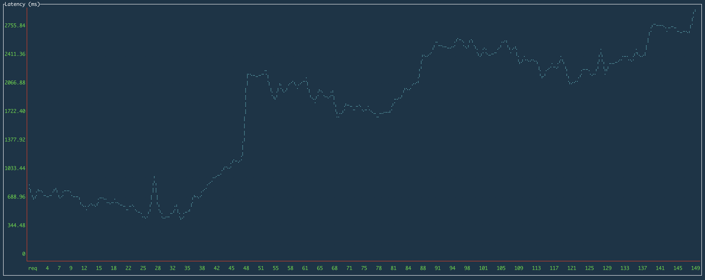
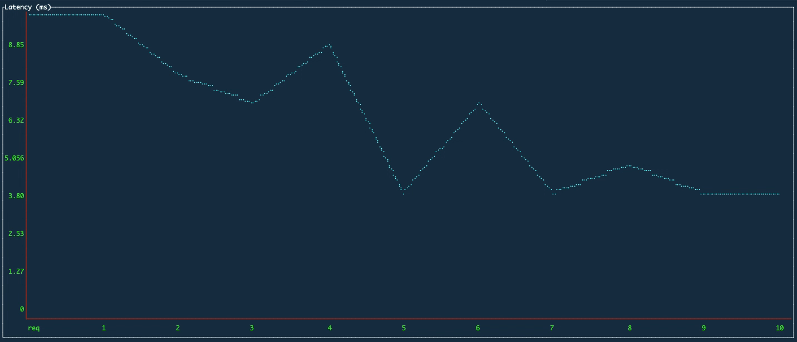
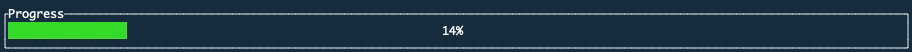
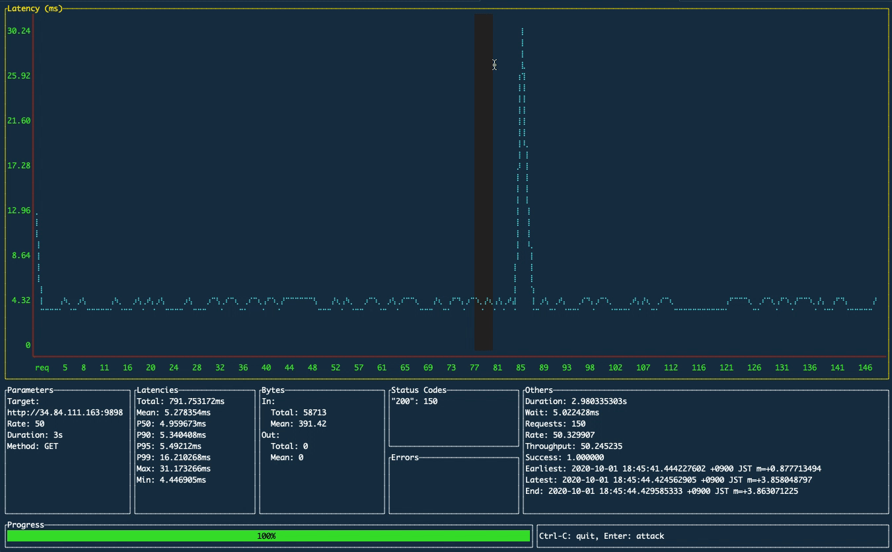

# ali
[](https://github.com/nakabonne/ali/releases/latest)
[](https://pkg.go.dev/github.com/nakabonne/ali)

A load testing tool capable of performing real-time analysis, inspired by [vegeta](https://github.com/tsenart/vegeta) and [jplot](https://github.com/rs/jplot).


`ali` comes with an embedded terminal-based UI where you can plot the metrics in real-time, so lets you perform real-time analysis on the terminal.

## Installation

Binary releases are available through [here](https://github.com/nakabonne/ali/releases).

**Via Homebrew**

```bash
brew install nakabonne/ali/ali
```

**Via APT**

```bash
wget https://github.com/nakabonne/ali/releases/download/v0.7.2/ali_0.7.2_linux_amd64.deb
apt install ./ali_0.7.2_linux_amd64.deb
```

**Via RPM**

```bash
rpm -ivh https://github.com/nakabonne/ali/releases/download/v0.7.2/ali_0.7.2_linux_amd64.rpm
```

**Via Pacman**

```bash
pacman -S ali
```

**Via Go**

Note that you may have a problem because it downloads an untagged binary.
```bash
go get github.com/nakabonne/ali
```

**Via Docker**

```bash
docker run --rm -it nakabonne/ali ali
```

## Usage
### Quickstart

```bash
ali http://host.xz
```
Replace `http://host.xz` with the target you want to issue the requests to.
Press Enter when the UI appears, then the attack will be launched with default options (rate=50, duration=10s).

### Options

```
ali -h
Usage:
  ali [flags] <target URL>

Flags:
  -b, --body string                A request body to be sent.
  -B, --body-file string           The path to file whose content will be set as the http request body.
      --cacert string              PEM ca certificate file
      --cert string                PEM encoded tls certificate file to use
  -c, --connections int            Amount of maximum open idle connections per target host (default 10000)
      --debug                      Run in debug mode.
  -d, --duration duration          The amount of time to issue requests to the targets. Give 0s for an infinite attack. (default 10s)
  -H, --header stringArray         A request header to be sent. Can be used multiple times to send multiple headers.
      --insecure                   Skip TLS verification
      --key string                 PEM encoded tls private key file to use
      --local-addr string          Local IP address. (default "0.0.0.0")
  -M, --max-body int               Max bytes to capture from response bodies. Give -1 for no limit. (default -1)
  -W, --max-workers uint           Amount of maximum workers to spawn. (default 18446744073709551615)
  -m, --method string              An HTTP request method for each request. (default "GET")
      --no-http2                   Don't issue HTTP/2 requests to servers which support it.
  -K, --no-keepalive               Don't use HTTP persistent connection.
      --query-range duration       The results within the given time range will be drawn on the charts (default 30s)
  -r, --rate int                   The request rate per second to issue against the targets. Give 0 then it will send requests as fast as possible. (default 50)
      --redraw-interval duration   The time interval to redraw charts (default 250ms)
      --resolvers string           Custom DNS resolver addresses; comma-separated list.
  -t, --timeout duration           The timeout for each request. 0s means to disable timeouts. (default 30s)
  -v, --version                    Print the current version.
  -w, --workers uint               Amount of initial workers to spawn. (default 10)

Examples:
  ali --duration=10m --rate=100 http://host.xz

Author:
  Ryo Nakao <ryo@nakao.dev>
```

Valid time units are "ns", "us" (or "µs"), "ms", "s", "m", "h".

**Examples**

For basic usage:

```bash
ali --rate=500 --duration=5m http://host.xz
```

For an infinite attack:

```bash
ali --duration=0 http://host.xz
```

For an attack with the POST method:

```bash
ali --body-file=/path/to/foo.json --method=POST http://host.xz
```

### Charts
Press `l` (or `h`) to switch the displayed chart. On all charts, you can click and drag to select a region to zoom into.

**Latency**



The X-axis represents the request counts and the Y-axis represents latencies in milliseconds.

**Percentiles**


You can see how the 50th, 90th, 95th, and 99th percentiles are changing.

**Bytes**

>TBA

**Histogram**

>TBA

## Features

### Plot in real-time



### Visualize the attack progress
This will help you during long tests.



### Mouse support
With the help of [mum4k/termdash](https://github.com/mum4k/termdash) can be used intuitively.



## Acknowledgements
This project would not have been possible without the effort of many individuals and projects but especially [vegeta](https://github.com/tsenart/vegeta) for the inspiration and powerful API.
Besides, `ali` is built with [termdash](https://github.com/mum4k/termdash) (as well as [termbox-go](https://github.com/nsf/termbox-go)) for the rendering of all those fancy graphs on the terminal.
They clearly stimulated an incentive to creation. A big "thank you!" goes out to all those who helped.
